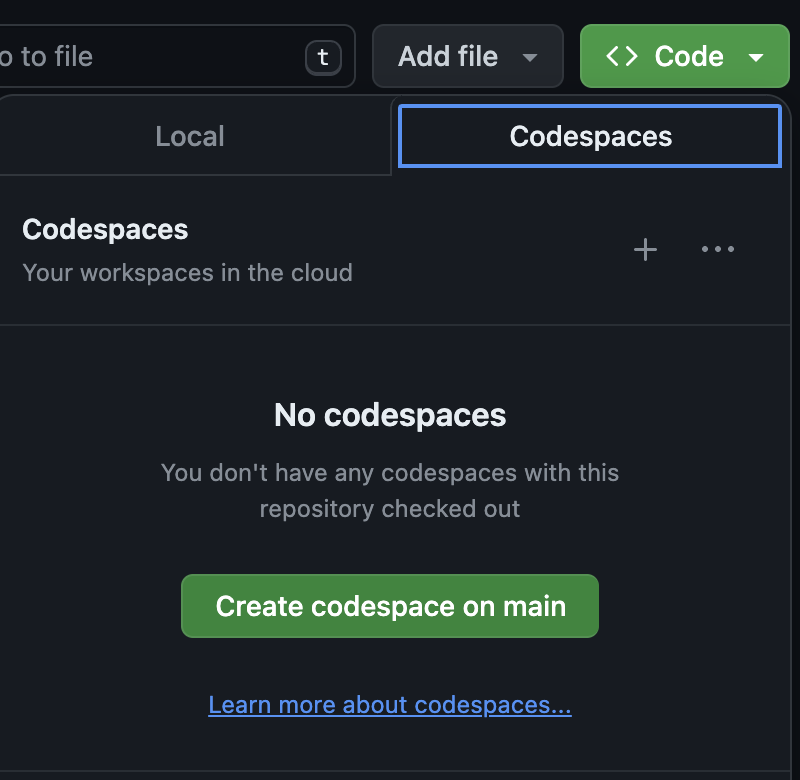
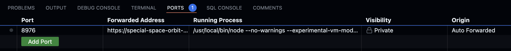
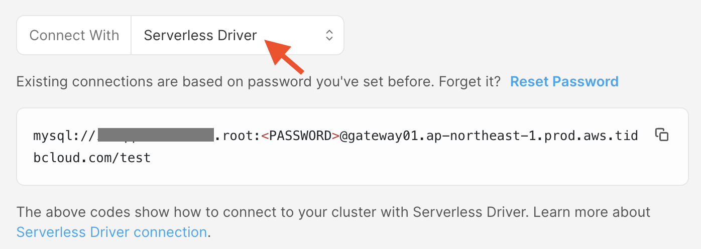

# Cloudflare Workers + TiDB Serverless 接続ワークショップ

このリポジトリでは、[GitHub Codespaces](https://github.com/features/codespaces)を利用して、[Cloudflare Workers から TiDB Serverlessに接続する](https://zenn.dev/kameoncloud/articles/99d3ed9d5ce4fd) の内容を実行していくことが出来ます。

下記の手順の通りに実施することで、Cloudflare WorkersからTiDB Serverlessへの接続が実行できます。
プログラムファイルを一から作りたい場合は、 `tidb-cloud-cloudflare` ディレクトリを削除して、`wrangler login`のステップを実行した後、ブログの流れを追ってください。

## 0. GitHub Codespaces を起動する

まず、GitHub Codespacesを起動します。 本リポジトリの右上の`<> Code`と書いてあるボタンを押し、`Codespaces`タブの｀Create Codespaces on main`ボタンを押します。



しばらくするとCodespacesが起動し、Visual Studio Code同様の画面が開くはずです。

この段階ですでに、

* 必要なツールは全てインストールされている
* `wrangler init` を実施してソースコードを書き換え済み

状態となっています。


## 1. wranglerを使ってcloudflareにログインする

`wrangler login` コマンドを使ってcloudflareにログインします。codespacesではOAuthを使ったログインを行いますが、
codespaces上ではコールバックを受け付けられないため、次のようなステップで実行します。

1. `wrangler login` コマンドを実行する。
   * `Failed to open` というエラーが表示されますが、表示されたURLを使ってブラウザでアクセスします。cloudflareのサイトが開きますので、アクセスを許可します。
2. コールバックURL文字列を取得
   * コールバックに失敗して、ブラウザでエラーになります。このとき表示されているURL文字列(`http://localhost:8976/...`)をコピーします。
3. ホスト名部分の書き換えと実行
   * Visual Studioの`ポート`タブを開くと、`「転送されたアドレス」（もしくは、Forwarded Address）`という欄があると思います。このアドレスをコピーし、先のステップでコピーしたURL文字列の `http://locahost:8976` 部分を置き換えます。この新しいURLをブラウザから実行します。

   

これでログインは完了です。

## 2. データベース接続文字列をシークレットに設定する

下記のコマンドでシークレット `DATABASE_URL`にDB接続文字列を設定します。接続文字列はTiDB ServerlessのConnectメニューから、
`Serverless Driver` を選択して取得することができます。

```bash
wrangler secret put DATABASE_URL
```




## 3. 必要なライブラリをインストールする

```bash
cd tidb-cloud-cloudflare
npm install 
```

## 4. デプロイする

```bash
npx wrangler deploy
```

デプロイが完了後に表示されたURLにアクセスすると、データベースの一覧が表示されます。

## 5. テーブルを作成する

さて、実際にデータを入れてみましょう。
`CREATE_TABLE.sql` に必要なDDLが含まれているので、TiDB ServerlessのChat2Queryで実行します。
また、codespacesにはSQL Tools拡張がインストールされているので、TiDBへの接続を作成してそこから実行しても構いません。

## 6. コードを修正して再度デプロイする

ソースコード中のコメントになっている部分のコメントを外して、再度デプロイします。
デプロイ後に表示されるURLにアクセスすると、テーブルの中身が表示されます。


