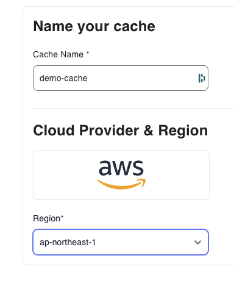
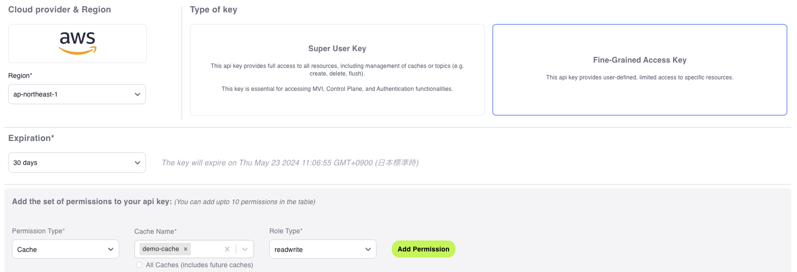

# Cloudflare Workers + Momento + TiDB Serverless 接続ワークショップ

このリポジトリでは、[GitHub Codespaces](https://github.com/features/codespaces)を利用して、[Cloudflare Workersを使って、TiDB Serverless のインラインキャッシュとしてMomentoを使うAPIサンプル](https://zenn.dev/kameoncloud/articles/a21e0dcb92b67d) の内容を実行していくことが出来ます。

下記の手順の通りに実施することで、ブログの内容通りに実装していくことができます。

## 0. 準備

### 0.1. GitHub Codespaces を起動する

まず、GitHub Codespacesを起動します。 本リポジトリの右上の`<> Code`と書いてあるボタンを押し、`Codespaces`タブの｀Create Codespaces on main`ボタンを押します。


しばらくするとCodespacesが起動し、Visual Studio Code同様の画面が開くはずです。

この段階で、ターミナルを開き、`client-sdk-javascript/examples/cloudflare-workers/http-api/` に移動し、下記のコマンドを実行します。

```bash
npm install
```

この段階で、

* 必要なツールは全てインストールされている
* 「Momento Cacheの実装」の「Cloudflare WorkersからMomento Cacheを呼び出す」のソースが実装済み

状態となっています。

### 0.2. wranglerを使ってcloudflareにログインする

`wrangler login` コマンドを使ってcloudflareにログインします。codespacesではOAuthを使ったログインを行いますが、
codespaces上ではコールバックを受け付けられないため、次のようなステップで実行します。

1. `wrangler login` コマンドを実行する。
   * `Failed to open` というエラーが表示されますが、表示されたURLを使ってブラウザでアクセスします。cloudflareのサイトが開きますので、アクセスを許可します。
2. コールバックURL文字列を取得
   * コールバックに失敗して、ブラウザでエラーになります。このとき表示されているURL文字列(`http://localhost:8976/...`)をコピーします。
3. ホスト名部分の書き換えと実行
   * Visual Studioの`ポート`タブを開くと、`「転送されたアドレス」（もしくは、Forwarded Address）`という欄があると思います。このアドレスをコピーし、先のステップでコピーしたURL文字列の `http://locahost:8976` 部分を置き換えます。この新しいURLをブラウザから実行します。

   

これでログインは完了です。

### 0.3. Momento Cacheの設定

Momento Cacheを設定し、APIキーを取得します。

まず、[Momentoコンソール](https://console.gomomento.com/)から、`demo-cache`というキャッシュを作成します。リージョンは`ap-northeast-1`を選択します。



その後、APIキーを取得します。APIキーは`Fine-Grained Access Key`を指定し、キャッシュ名は`demo-cache`、ロールタイプは`read-write`を選択します。`Add Permission` を押し、その後`Generate Api Key`ボタンを押します。



APIキーが表示されるので、クリップボードにコピーしておきます。このAPIをCloudflare Workersに設定していきます。

1. `client-sdk-javascript/examples/cloudflare-workers/http-api/` に移動し、`.dev.vars.tpl`をコピーして、`.dev.vars`ファイルを作成します。
2. ファイル中の、`MOMENTO_AUTH_TOKEN`の値を書き換えて、先ほどのAPIキーを設定します。
3. コンソールから、下記のコマンドを実行して、cloudflare workersの環境変数にも同じキーを設定します。

   ```bash
   npx wrangler secret put MOMENTO_AUTH_TOKEN
   ```

ここまで完了すれば、Workersのデプロイが出来る状態になっているはずです。次のコマンドでデプロイを行い、出力されたURLにアクセスしてエラーが出ないことを確認します。

   ```bash
   npm run deploy
   ```

### 0.4. TiDB Serverlessの設定

[TiDB Cloud](https://tidbcloud.com/)にログインし、TiDB Cloudコンソールを開きます。
Chat2Queryのコンソールから、本リポジトリの`CREATE_TABLE.sql`の内容を貼り付け、全て実行します。

下記のコマンドでシークレット `DATABASE_URL`にDB接続文字列を設定します。接続文字列はTiDB ServerlessのConnectメニューから、
`Serverless Driver` を選択して取得することができます。

```bash
wrangler secret put DATABASE_URL
```


## 1. ブログの手順を実行 (1. Momento Cacheの実装)

ここからはブログのステップを実行していきます。まず、`1. Momento Cacheの実装` を進めます。
ここではソースを変更するのみですので、ブログ記載の通りにソースを修正します。その後、下記のコマンドを実行してデプロイを実施します。

なお、このソースは `worker_1.ts` として本リポジトリにも含まれているので、必要に応じて利用してください。

```bash
npm run deploy
```

出力されたURLに、`/?key=[任意のキー]&value=[任意の値]&opt=[GET | POST]` を付与してアクセスし、エラーが出ないことを確認します。
POSTを指定すると指定したキーに値を保存し、GETを指定するとその値を取り出します。

## 2. ブログの手順を実行 (2. TiDB Serverlessの実装 前半)

ブログ記載の通りにソースを修正します。その後、下記のコマンドを実行してデプロイを実施します。

なお、このソースは `worker_2.ts` として本リポジトリにも含まれているので、必要に応じて利用してください。

```bash
npm run deploy
```

先ほど同様に、出力されたURLに、`/?key=[任意のキー]&value=[任意の値]&opt=[GET | POST]` を付与してアクセスし、エラーが出ないことを確認します。結果としてデータベースの一覧がJSON形式で返ります。

## 3. ブログの手順を実行 (2. TiDB Serverlessの実装 後半)

ブログ記載の通りにソースを修正します。その後、下記のコマンドを実行してデプロイを実施します。

なお、このソースは `worker_3.ts` として本リポジトリにも含まれているので、必要に応じて利用してください。

```bash
npm run deploy
```

先ほど同様に、出力されたURLに、`/?key=[任意のキー]&value=[任意の値]&opt=[GET | POST]` を付与してアクセスします。
テーブル定義の都合上、valueに指定する値は整数にする必要がありますので注意してください。

POSTを行うとデータベースとキャッシュにデータを保存し、GETの時はキャッシュにあればキャッシュを、キャッシュになければデータベースから値を取得して返します。
